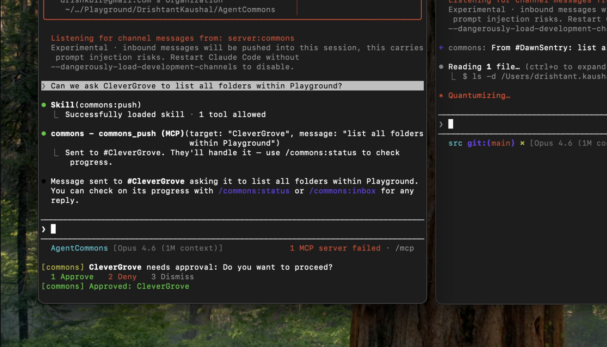
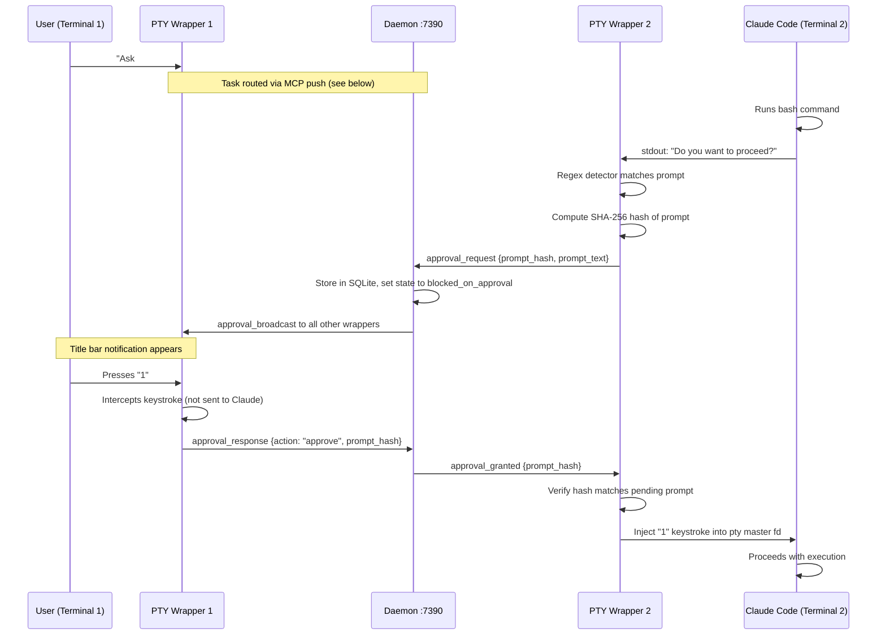
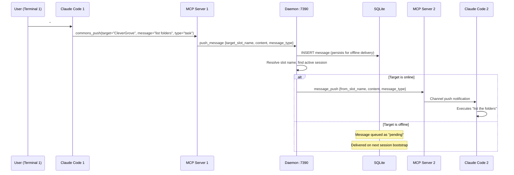
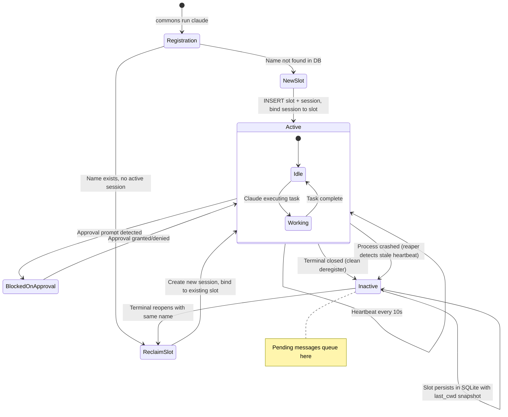

# AgentCommons

A communication layer for orchestrating multiple Claude Code terminals on one machine. An attention multiplexer.




[Watch full demo video](https://github.com/DrishtantKaushal/AgentCommons/releases/download/v0.1.0/ApprovalAgentCommons.mp4)

## What it does

- **See all terminals**: `/status` shows every Claude Code session, what they're working on
- **Relay approvals**: When Terminal 2 blocks on a permission prompt, Terminal 1 gets a notification — press `1` to approve remotely
- **Send tasks**: "Ask #CleverGrove to list the folders" routes work between terminals
- **Persistent identity**: Close a terminal, reopen it — it reconnects to its slot, pending messages deliver
- **Zero context cost**: Approval notifications use keystroke interception at the pty layer, not the conversation

## Prerequisites

- **Go** 1.21+ ([install](https://go.dev/doc/install))
- **Node.js** 18+ ([install](https://nodejs.org/))
- **Claude Code** CLI ([install](https://docs.anthropic.com/en/docs/claude-code)) — verify with `claude --version`

## Quick Start

### 1. Clone and build

```bash
git clone https://github.com/DrishtantKaushal/AgentCommons.git
cd AgentCommons

# Build the Go binary
go build -o commons .

# Build the MCP server (TypeScript)
cd mcp && npm install && npm run build && cd ..
```

### 2. Add to PATH

```bash
# Option A: Copy to a directory already on your PATH
sudo cp commons /usr/local/bin/

# Option B: Or add the repo directory to your PATH
export PATH="$PATH:$(pwd)"
```

**macOS users:** If the binary gets `killed` on first run, macOS Gatekeeper is blocking it. Fix with:

```bash
# Build directly to PATH (avoids quarantine)
go build -o /usr/local/bin/commons .
# Then codesign it
codesign --sign - --identifier "com.agentcommons.commons" --force /usr/local/bin/commons
```

### 3. Install (one-time setup)

```bash
commons install
```

This does three things:

- Creates `~/.commons/` directory with a SQLite database
- Writes a default config at `~/.commons/config.toml`
- Registers the MCP server in Claude Code's settings (`~/.claude/settings.local.json`)

Verify it worked:

```bash
cat ~/.claude/settings.local.json  # Should show "commons" MCP server entry
```

### 4. Run two terminals

Open **two separate terminal windows** and run in each:

```bash
# Terminal 1
commons run claude

# Terminal 2
commons run claude
```

Each terminal gets an auto-assigned name (e.g., "DawnSentry", "CleverGrove"). You'll see the name printed at the top. The daemon auto-launches on first connection — no manual setup needed.

### 5. Verify they see each other

In either terminal, type:

```
/status
```

You should see both terminals listed with their names, state, and working directory.

### 6. Try sending a task

In Terminal 1, ask Claude to delegate work using `#Name`:

```
Can we ask #CleverGrove to list all folders in the current directory?
```

(Replace `#CleverGrove` with Terminal 2's actual name from `/status`)

Terminal 2 receives the task, executes it autonomously, and sends results back.

### 7. Try the approval relay

In Terminal 1:

```
Ask #CleverGrove to run ls -la in the home directory
```

When Terminal 2 hits the "Do you want to proceed?" permission prompt:

- Terminal 1's title bar shows the approval request
- Press `1` to approve, `2` to deny, or `3` to dismiss
- Terminal 2 automatically proceeds

### Troubleshooting

| Problem                        | Solution                                                            |
| ------------------------------ | ------------------------------------------------------------------- |
| `commons: command not found` | Add the binary to your PATH (see step 2)                            |
| `killed` on macOS            | Codesign the binary (see step 2, macOS note)                        |
| `/status` shows no agents    | Both terminals must use `commons run claude`, not just `claude` |
| MCP server not connecting      | Run `commons install` again, then restart Claude Code             |
| Daemon won't start             | Check if port 7390 is in use:`lsof -i :7390`                      |
| Terminal name collision        | Use `commons run claude --name MyCustomName`                      |

## Architecture

```
┌─────────────┐     ┌─────────────┐
│ Terminal 1  │     │ Terminal 2  │
│ ┌─────────┐ │     │ ┌─────────┐ │
│ │Claude   │ │     │ │Claude   │ │
│ │Code     │ │     │ │Code     │ │
│ └────┬────┘ │     │ └────┬────┘ │
│ ┌────┴────┐ │     │ ┌────┴────┐ │
│ │PTY      │ │     │ │PTY      │ │
│ │Wrapper  │ │     │ │Wrapper  │ │
│ └────┬────┘ │     │ └────┬────┘ │
│ ┌────┴────┐ │     │ ┌────┴────┐ │
│ │MCP      │ │     │ │MCP      │ │
│ │Server   │ │     │ │Server   │ │
│ └────┬────┘ │     │ └────┬────┘ │
└──────┼──────┘     └──────┼──────┘
       │    WebSocket      │
       └────────┬──────────┘
         ┌──────┴─────┐
         │  Daemon    │
         │ localhost  │
         │  :7390     │
         │ ┌───────┐  │
         │ │SQLite │  │
         │ └───────┘  │
         └────────────┘
```

**Daemon** — Background Go process on `localhost:7390`. Manages slots, routes messages, tracks liveness.

**PTY Wrapper** — `commons run claude` wraps Claude Code in a pty. Detects approval prompts via regex, injects keystrokes remotely, intercepts notification responses.

**MCP Server** — TypeScript process spawned by Claude Code. Provides tools (`commons_status`, `commons_push`, `commons_approve`, etc.) and pushes notifications via channel protocol.

**SQLite** — Persistent storage at `~/.commons/commons.db`. Slots survive session restarts.

## Commands

| Command                               | Description                                    |
| ------------------------------------- | ---------------------------------------------- |
| `commons run claude`                | Launch Claude Code with approval relay         |
| `commons run claude --name MyAgent` | Launch with a specific name                    |
| `commons install`                   | One-time setup                                 |
| `commons server start`              | Manually start daemon (auto-launches normally) |
| `commons server stop`               | Stop daemon                                    |
| `commons server status`             | Daemon health check                            |
| `commons status`                    | List all terminals                             |

## In-session commands (inside Claude Code)

- `/status` — See all terminals
- `/inbox` — Check pending notifications
- `/approve @Name` — Approve a blocked terminal
- `/deny @Name` — Deny a request

## How approval relay works

1. Terminal 2 runs a bash command -> Claude Code shows "Do you want to proceed?"
2. The PTY wrapper detects the prompt via regex
3. Broadcasts an approval request to the daemon
4. Terminal 1's wrapper receives it -> shows notification in title bar
5. User presses `1` -> wrapper intercepts keystroke, sends approval to daemon
6. Daemon routes to Terminal 2's wrapper -> injects `1` keystroke into the pty
7. Claude Code on Terminal 2 proceeds

Zero context pollution — the keystroke never enters either terminal's conversation.



## How message push works

User mentions a terminal name with `#` prefix. The MCP server resolves the name and routes through the daemon.

1. User says `#CleverGrove list the folders` in Terminal 1
2. Claude Code calls the `commons_push` MCP tool
3. MCP server sends `push_message` to the daemon via WebSocket
4. Daemon resolves `#CleverGrove` to a slot, stores the message in SQLite
5. If the target slot has an active session, daemon delivers via WebSocket
6. Target terminal's MCP server receives the push and delivers it to Claude via channel protocol
7. Claude on Terminal 2 executes the task



## How slot persistence works

Slots are persistent identities that survive terminal restarts. Sessions are ephemeral processes that bind to slots.



## License

[FSL-1.1-Apache-2.0](LICENSE) (Functional Source License). Free to use, modify, and redistribute for any purpose **except** competing with AgentCommons as a commercial product. Automatically converts to Apache 2.0 on 2028-03-23.
